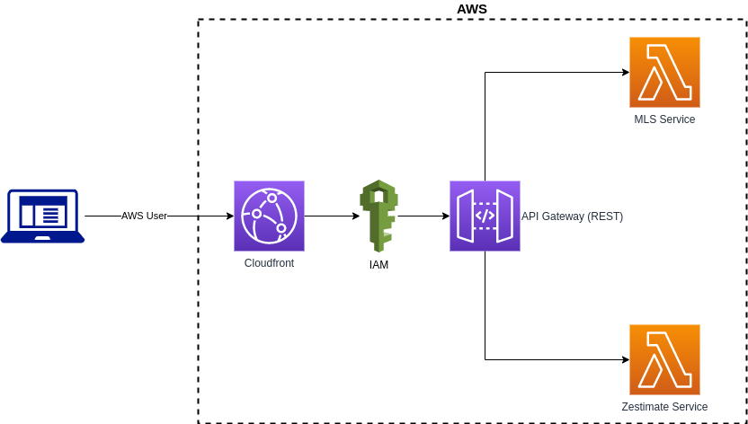

# House App Client

## Overview

A simple client app written using React framework to help find investment properties. It communicates with two back-end serverless services. The client first makes a call to the MLS service to fetch a set of houses on the market for a given city and state. The list of houses is than sent to the Zillow service that returns back more details on the houses and set of metrics to help decide if it is a viable investment.

## Architecture (System Design)

## Security

This client app authenticates with API gateway using IAM, an IAM user has been created for this app and associated to a policy that allows for invoking APIs. The client generates signed request, and adds the `Authorization` header.

## Usage

Enter city and state to search for properties.
